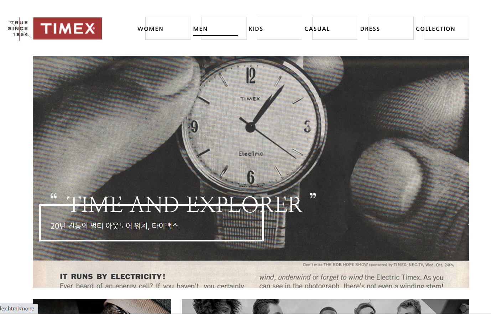

# timex
[HTML, JS, CSS] TIMEX 홈페이지 가상 리뉴얼 PC웹페이지 입니다.

- 메인 시계이미지 JS사용하여 현재시간 나타내는 시계바늘 움직이도록 하였습니다.
- 숨김텍스트 이용하여 접근성 사용자도 현재시간을 알수 있도록 작성하였습니다.
- 메인 카피문구 효과는 JS없이 CSS animation 이용하여 구현하였습니다.
- IE10이상, chrome에서 정상작동합니다.

